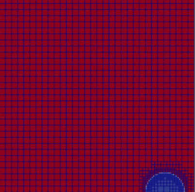
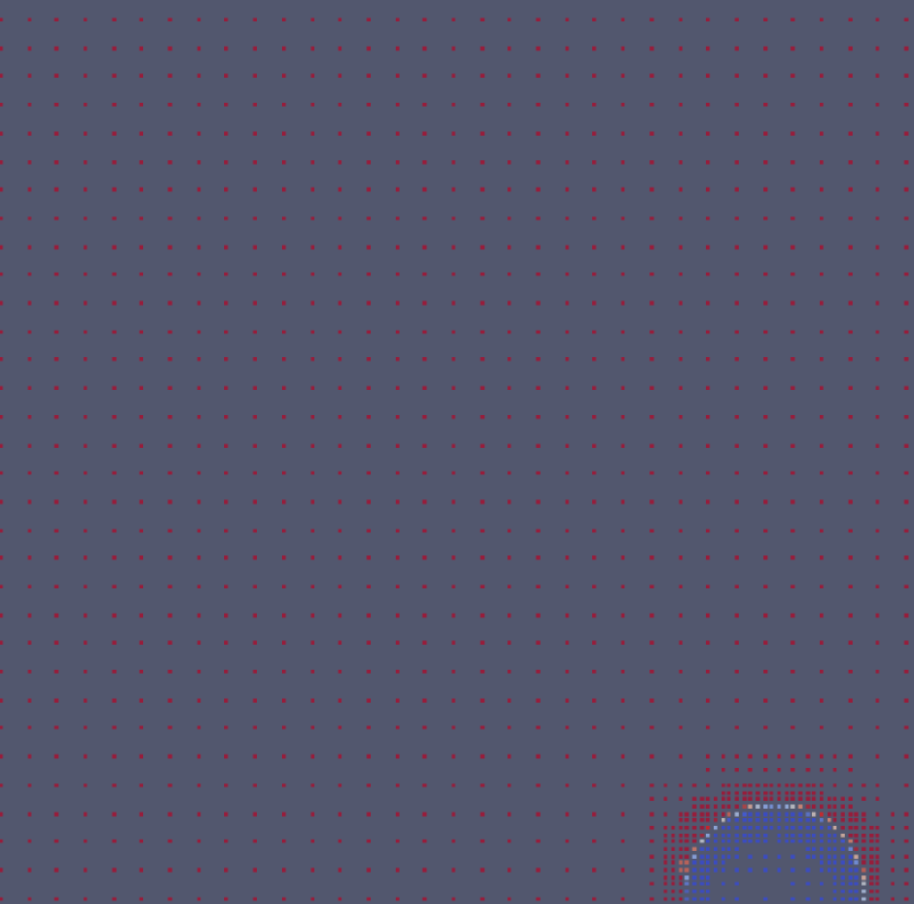
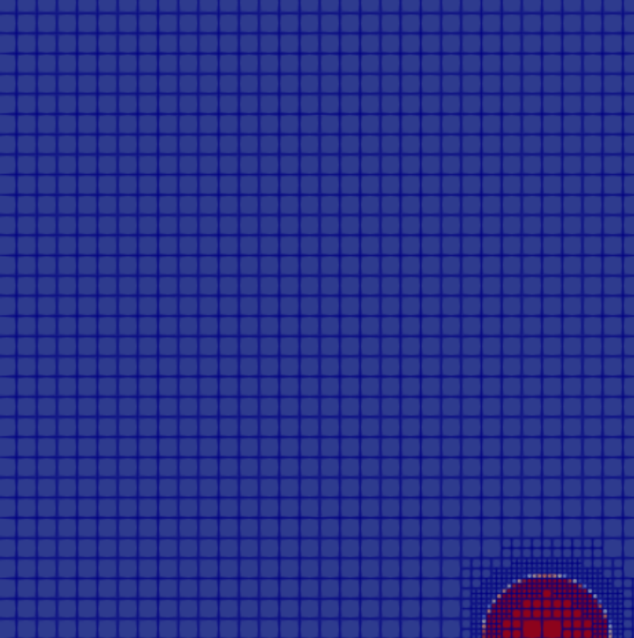
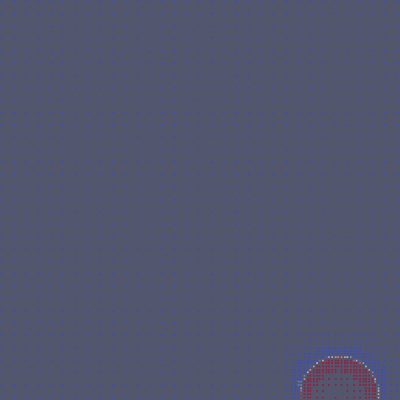
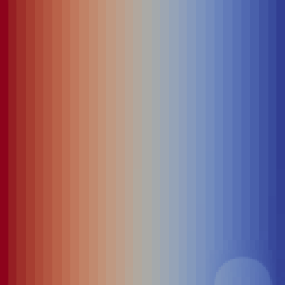
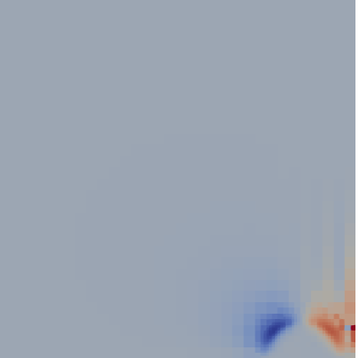

# Numerical Simulation of Three-Phase Flow

> **Research Paper | BITS Pilani | Jan–May 2025**
> Thilak S · Under Prof. Shyam Sunder Yadav
> Department of Mechanical Engineering, BITS Pilani
> `f20220771@pilani.bits-pilani.ac.in`

A numerical framework for dynamic modeling of three-phase bubble rise using the **Volume-of-Fluid (VOF)** method implemented in **Basilisk C**, with **Adaptive Mesh Refinement (AMR)** for high-resolution interface tracking at reduced computational cost.

---

## Abstract

Numerical simulation of three-phase flow presents challenges due to complex interfacial dynamics, phase interactions, and stability constraints. This work presents a framework for dynamic modeling of three-phase bubble rise using VOF in Basilisk C. Utilizing AMR, the simulation combines precise interface resolution with high computational efficiency. The Navier-Stokes solver incorporates surface tension forces to capture capillary pressure effects, bubble deformation, interface evolution, and bubble-induced vortices. The simulation produces a gas plume that rises as a buoyant jet through two stratified liquid layers, analyzing velocity, plume shape evolution, and interfacial properties.

**Index Terms:** Three-phase flow, Volume-of-Fluid (VOF), Basilisk C, Adaptive Mesh Refinement (AMR), Navier-Stokes equations, surface tension, bubble dynamics, CFD

---

## Motivation

Gas, liquid, and solid three-phase interactions play a critical role in chemical processing, oil recovery, and environmental fluid mechanics. These systems exhibit complex interfacial dynamics — bubble-particle collisions, phase separation, and interfacial instabilities — which directly affect process efficiency and stability.

**Why existing methods fall short:**
- **Level-set methods** — limited in handling triple-phase contact lines and large density ratios
- **Discrete Element Modeling (DEM)** — struggles with realistic interface evolution and correct interfacial tension parameters
- **Fixed-grid approaches** — cannot adaptively resolve sharp gradients at interfaces without prohibitive computational cost

This work addresses these challenges by combining VOF with AMR in Basilisk C, enabling dynamic mesh refinement precisely at phase boundaries and triple contact lines.

---

## Key Results

| Result | Detail |
|--------|--------|
| **Interface Evolution** | Dynamic tracking of f1, f2, f3 volume fractions over time |
| **Bubble Dynamics** | Deformation and trajectory through stratified liquid layers confirmed buoyancy-dominant behavior |
| **Surface Tension** | Vortex generation around bubbles quantified via pressure distribution |
| **Velocity Field** | u.x and u.y confirm upward plume and recirculation zones at interfaces |
| **AMR Advantage** | Higher interface resolution vs fixed-grid at comparable computational cost |

---

## Simulation Parameters

<table>
<tr>
<td>

**Surface Tension Coefficients (Case 1 — Non-spreading)**

| Parameter | Value (N/m) |
|-----------|-------------|
| σ₁ (Phase 1 – Phase 2) | 0.02 |
| σ₂ (Phase 2 – Phase 3) | 0.04 |
| σ₃ (Phase 1 – Phase 3) | 0.03 |

**Surface Tension Coefficients (Case 2 — Spreading)**

| Parameter | Value (N/m) |
|-----------|-------------|
| σ₁ (Phase 1 – Phase 2) | 0.04 |
| σ₂ (Phase 2 – Phase 3) | 0.04 |
| σ₃ (Phase 1 – Phase 3) | −0.01 |

</td>
<td>

**Fluid Properties**

| Parameter | Phase 1 (Gas) | Phase 2 (Liquid) | Phase 3 (Liquid) |
|-----------|--------------|-----------------|-----------------|
| ρ (kg/m³) | 1.0 | 1000.0 | 1000.0 |
| μ (Pa·s) | 0.01 | 1.0 | 1.0 |

**AMR Settings**

| Parameter | Value |
|-----------|-------|
| Maximum refinement level | 8 |
| Minimum refinement level | 4 |
| Refinement criterion | f1, f2, f3, u.x, u.y wavelet threshold 10⁻³ |

**Initial Geometry**

| Parameter | Value |
|-----------|-------|
| Bubble radius (r₀) | 0.10 |
| Bubble centre (x₀) | 0.50 |
| Phase 3 | Sphere of radius r₀ centred at x₀ |
| Phase 2 | Left half-domain (x < x₀) |
| Phase 1 | Remainder of domain |

</td>
</tr>
</table>

### Mesh & Solver Configuration

| Parameter | Value |
|-----------|-------|
| Geometry | Axisymmetric (Basilisk `axi.h`) |
| Base mesh | 64 × 64 cells |
| Max AMR level | 8 |
| Min AMR level | 4 |
| Boundary — axis | Symmetry (cylindrical geometry) |
| Boundary — upper/lower | Outflow |
| Boundary — bottom wall | No-slip |
| VTK output interval | Every 100 iterations |
| Dump output | Every 5.0 time units up to t = 35 |
| Solver | Basilisk C (open-source CFD toolbox) |
| Post-processing | ParaView |
| OS | Ubuntu |

---

## Theoretical Background

### Three-Phase Flow Concepts

**1. Wettability Order**
The wettability order governs the relative arrangement of phases in porous media. It controls the range of pore sizes occupied by each fluid phase, which in turn determines flow conductance and trapping processes.

**2. Flow Patterns**
Three-phase flow can exhibit several configurations depending on how the liquid phases are distributed:
- **Stratified flow** — phases separated by gravity into distinct horizontal layers
- **Slug flow** — alternating plugs of gas and liquid
- **Annular flow** — gas core surrounded by liquid film on walls

---

## Governing Equations

### Three-Phase Continuity

Each phase $i$ satisfies mass conservation:

$$\frac{\partial \alpha_i \rho_i}{\partial t} + \nabla \cdot (\alpha_i \rho_i \mathbf{u}_i) = 0$$

with the volume fraction constraint ensuring the domain is fully occupied at all times:

$$\sum_{i=1}^{n} \alpha_i = 1$$

### Energy Conservation (Phase Change)

When accounting for heat during phase change:

$$\frac{\partial T}{\partial t} + \mathbf{u} \cdot \nabla T = \frac{1}{\rho C_p} \nabla \cdot (\kappa \nabla T) + \frac{Q}{\rho C_p}$$

### VOF Advection

$$\frac{\partial F}{\partial t} + \mathbf{u} \cdot \nabla F = 0$$

### Interface Representation — Mixture Properties

$$\rho = \sum_{m=1}^{n} \alpha_m \rho_m$$

### Surface Tension (Continuum Surface Force)

$$\mathbf{F}_{st} = \sigma \kappa \mathbf{n} \delta_s, \qquad \kappa = \nabla \cdot \left( \frac{\nabla F}{|\nabla F|} \right)$$

### Momentum Equation (Navier-Stokes)

$$\frac{\partial \rho \mathbf{u}}{\partial t} + \nabla \cdot (\rho \mathbf{u}\mathbf{u}) = -\nabla p + \nabla \cdot (\mu \nabla \mathbf{u}) + \mathbf{F}_{st} + \mathbf{F}_g$$

### AMR Refinement Criterion

$$\text{Refine if} \quad |\nabla F| > C_{\text{threshold}}$$

---

## Repository Structure

```
three-phase-flow-vof/
├── src/
│   ├── testcase-3p.c          # Main simulation — initial conditions, events, output
│   ├── three-phase.h          # Three-phase flow setup (density, viscosity, VOF fields)
│   ├── vof-3p.h               # Modified VOF advection for three-phase flows
│   ├── fractions.h            # Modified interface reconstruction (PLIC for triple contact lines)
│   ├── conserving-3p.h        # Momentum-conserving VOF advection (optional)
│   ├── vtknew_cell.h          # VTK cell-centred AMR output (ParaView compatible)
│   ├── compile.sh             # Build script
│   └── clean.sh               # Cleanup script
├── outputs/
│   ├── f1_surface.png         # Fig 1a — Phase 1 surface
│   ├── f1_surface_edges.png   # Fig 1b — Phase 1 surface with edges
│   ├── f1_points.png          # Fig 1c — Phase 1 points
│   ├── f2_surface.png         # Fig 2a — Phase 2 surface
│   ├── f2_surface_edges.png   # Fig 2b — Phase 2 surface with edges
│   ├── f2_points.png          # Fig 2c — Phase 2 points
│   ├── f3_surface.png         # Fig 3a — Phase 3 surface
│   ├── f3_surface_edges.png   # Fig 3b — Phase 3 surface with edges
│   ├── f3_points.png          # Fig 3c — Phase 3 points
│   ├── pressure_surface.png   # Fig 4  — Pressure & vortex generation
│   ├── ux_surface.png         # Fig 5a — Velocity field u.x
│   └── uy_surface.png         # Fig 5b — Velocity field u.y
├── paper/
│   └── Numerical_Simulation_of_Three-Phase_Flow.pdf
└── README.md
```

---

## Code Structure (Basilisk C)

The simulation is split across seven source files:

### `testcase-3p.c` — Main Simulation Driver
Sets fluid properties, runs the simulation loop, handles adaptive refinement, and manages all output events:

```c
// Two embedded test cases (non-spreading / spreading)
#define SIGMA_1 0.02   // Phase 1–2 surface tension
#define SIGMA_2 0.04   // Phase 2–3 surface tension
#define SIGMA_3 0.03   // Phase 1–3 surface tension

rho1 = 1.0;    rho2 = 1000.0;  rho3 = 1000.0;
mu1  = 1.0e-2; mu2  = 1.0e-0;  mu3  = 1.0e-0;

// AMR driven by volume fractions and velocity
adapt_wavelet ({f1, f2, f3, u.x, u.y},
               (double[]){1e-3, 1e-3, 1e-3, 1e-3, 1e-3},
               maxlevel = 8, minlevel = 4);
```

### `three-phase.h` — Three-Phase Flow Setup
Declares the three VOF scalar fields `f1`, `f2`, `f3` and defines the mixture density/viscosity using arithmetic averaging:

```c
scalar f1[], f2[], f3[], *interfaces = {f1, f2, f3};

#define rho(f1,f2,f3) (clamp(f1,0.,1.)*rho1 + clamp(f2,0.,1.)*rho2 + clamp(f3,0.,1.)*rho3)
#define mu(f1,f2,f3)  (clamp(f1,0.,1.)*mu1  + clamp(f2,0.,1.)*mu2  + clamp(f3,0.,1.)*mu3)
```

Applies a cutoff `R_VOFLIMIT = 1e-3` to eliminate cells with negligible phase fractions, reducing numerical noise near triple contact lines.

### `vof-3p.h` — Modified VOF Advection
Based on the standard Basilisk `vof.h` but uses the modified `fractions.h` for interface reconstruction in two-phase cells of a three-phase system.

### `fractions.h` — Modified Interface Reconstruction
The key algorithmic contribution. Handles the special case of **two-phase cells** in a three-phase flow where two interfaces coexist. For such cells, instead of computing two independent normals, it volume-averages the interface normals to produce a single consistent interface — avoiding non-physical double-interface artefacts near the triple contact line:

```c
// Detect two-phase cells and average normals volumetrically
if (f1[] == 0. && f2[] > 0. && f2[] < 1. && f3[] > 0. && f3[] < 1.) {
    m1 = mycs(point, f2);  // normal for Phase 2 interface
    m2 = mycs(point, f3);  // normal for Phase 3 interface
    // Volume-weighted average → single consistent interface normal
}
```

### `conserving-3p.h` — Momentum-Conserving Advection (Optional)
Implements momentum-conserving VOF advection by transporting phase momenta $q_i = f_i \rho_i \mathbf{u}$ alongside the volume fractions. Commented out in the default configuration but available for higher-fidelity runs.

### `vtknew_cell.h` — VTK Cell-Centred Output
Exports AMR grid data as VTK unstructured grids without interpolation to a uniform mesh, preserving the actual adaptive grid structure for visualisation in ParaView. Each cell is stored as a `VTK_PIXEL` (2D) or `VTK_VOXEL` (3D).

---

## Running the Simulation

### Install Basilisk C
```bash
darcs get http://basilisk.fr/basilisk
cd basilisk/src
make
export BASILISK=$PWD
export PATH=$PATH:$BASILISK
```

### Compile
```bash
cd src/
qcc -fopenmp -Wall -O2 testcase-3p.c -o a.out \
    -L$BASILISK/gl -lglutils -lfb_glx -lGLU -lGLEW -lGL -lX11 -lm
```

Or use the provided script:
```bash
chmod +x compile.sh
./compile.sh
```

### Run
```bash
./a.out
```

Expected outputs:
- `fields_N.vtk` — VTK files every 100 iterations (open in ParaView)
- `dump-T` — Basilisk dump files every 5.0 time units up to t = 35
- `movie.mp4` — Full-domain interface animation
- `zoom.mp4` — Zoom on the triple contact point
- `log` — Volume conservation errors and max velocity per timestep

### Clean up output files
```bash
./clean.sh
```

### Switch to Spreading Case (Case 2)
In `testcase-3p.c`, change the `#if 1` to `#if 0` at line 16 to use the spreading configuration (σ₃ = −0.01).

### Post-Processing (ParaView)

Load `fields_*.vtk` in ParaView. Three representation modes used:

| Mode | Purpose |
|------|---------|
| **Surface** | Smooth interface visualisation |
| **Surface with Edges** | Displays AMR mesh structure |
| **Points** | Discrete phase data at cell centres |

Visualise: `f1`, `f2`, `f3` (volume fractions), `p` (pressure), `u.x`, `u.y` (velocity components).

---

## Results

### Figure 1 — Interface Evolution Over Time (f1)

Phase 1 volume fraction tracked over time, showing interface deformation consistent with theoretical buoyancy-driven flow predictions.

<p align="center">
  
  &nbsp;&nbsp;
  
  &nbsp;&nbsp;
  
</p>
<p align="center">
  <em>(a) f1 – surface &nbsp;&nbsp;&nbsp;&nbsp;&nbsp;&nbsp;&nbsp;&nbsp;&nbsp; (b) f1 – surface with edges &nbsp;&nbsp;&nbsp;&nbsp;&nbsp;&nbsp;&nbsp;&nbsp;&nbsp; (c) f1 – points</em>
</p>

---

### Figure 2 — Deformation and Trajectory of Bubble (f2)

Phase 2 bubble dynamics showing deformation and trajectory as the bubble ascends through stratified liquid layers. Buoyancy confirmed as the dominant driving force.

<p align="center">
  
  &nbsp;&nbsp;
  
  &nbsp;&nbsp;
  
</p>
<p align="center">
  <em>(a) f2 – surface &nbsp;&nbsp;&nbsp;&nbsp;&nbsp;&nbsp;&nbsp;&nbsp;&nbsp; (b) f2 – surface with edges &nbsp;&nbsp;&nbsp;&nbsp;&nbsp;&nbsp;&nbsp;&nbsp;&nbsp; (c) f2 – points</em>
</p>

---

### Figure 3 — Deformation and Trajectory of Bubble (f3)

Phase 3 dynamics illustrating interaction between the third phase and surrounding liquid layers, demonstrating the framework's ability to handle complex triple-phase contact lines.

<p align="center">
  
  &nbsp;&nbsp;
  
  &nbsp;&nbsp;
  
</p>
<p align="center">
  <em>(a) f3 – surface &nbsp;&nbsp;&nbsp;&nbsp;&nbsp;&nbsp;&nbsp;&nbsp;&nbsp; (b) f3 – surface with edges &nbsp;&nbsp;&nbsp;&nbsp;&nbsp;&nbsp;&nbsp;&nbsp;&nbsp; (c) f3 – points</em>
</p>

---

### Figure 4 — Pressure Distribution & Vortex Generation

Pressure distribution (p) around rising bubbles reveals vortex formation driven by surface tension. This directly influences flow patterns and mass transfer rates between phases.

<p align="center">
  
  <br>
  <em>Fig. 4: Pressure distribution & vortex generation around the bubbles (p-surface)</em>
</p>

---

### Figure 5 — Velocity Field Analysis (u.x and u.y)

Velocity components confirm expected flow patterns: upward plume in bubble wake, recirculation zones at phase interfaces, and surface-tension-driven lateral flows.

<p align="center">
  
  &nbsp;&nbsp;
  
</p>
<p align="center">
  <em>(a) u.x – surface &nbsp;&nbsp;&nbsp;&nbsp;&nbsp;&nbsp;&nbsp;&nbsp;&nbsp;&nbsp;&nbsp;&nbsp;&nbsp;&nbsp;&nbsp;&nbsp;&nbsp;&nbsp;&nbsp;&nbsp;&nbsp;&nbsp;&nbsp;&nbsp;&nbsp;&nbsp; (b) u.y – surface</em>
</p>

---

## Novel Contributions

1. **Modified Interface Reconstruction for Two-Phase Cells** — The key contribution in `fractions.h`: near triple contact lines, cells containing two interfaces are handled by volumetrically averaging the two interface normals into a single consistent normal. This prevents non-physical double-interface artefacts that arise in standard VOF implementations.

2. **Higher Interface Resolution** — AMR achieves finer resolution at phase boundaries than fixed-grid approaches, crucial for complex interfacial dynamics without prohibitive computational cost.

3. **Robust Validation Against Theory** — Results closely match theoretical models for buoyancy-driven three-phase flows.

4. **Industrial Applicability** — Framework directly applicable to oil recovery, chemical processing, environmental engineering, and waste minimisation.

---

## References

1. G. Pozzetti and B. Peters, *International Journal of Multiphase Flow*, vol. 99, pp. 186–204, 2018.
2. C. Zhao et al., *arXiv:2310.12826*, 2023.
3. M. Bagheri et al., *The Canadian Journal of Chemical Engineering*, vol. 100, no. 9, pp. 2291–2308, 2022.
4. M. Shen and B. Q. Li, *RSC Advances*, vol. 13, no. 6, pp. 3561–3574, 2023.
5. J. Kim and J. Lowengrub, *Interfaces and Free Boundaries*, vol. 7, no. 4, pp. 435–466, 2005.
6. X. Yuan et al., *Physics of Fluids*, vol. 34, no. 2, 2022.
7. S. Mirjalili and A. Mani, *Journal of Computational Physics*, vol. 498, p. 112657, 2024.
8. L. Zeng et al., *Fluids*, vol. 6, no. 9, p. 317, 2021.
9. Z. Xie et al., *International Journal for Numerical Methods in Fluids*, vol. 92, no. 7, pp. 765–784, 2020.
10. Z. Wang et al., *Journal of Computational Physics*, vol. 516, p. 113297, 2024.
11. Y. F. Yap et al., *International Journal of Heat and Mass Transfer*, vol. 115, pp. 730–740, 2017.
12. S. Aihara et al., *Theoretical and Computational Fluid Dynamics*, vol. 37, no. 5, pp. 639–659, 2023.
13. C. Zhan et al., *Physica D: Nonlinear Phenomena*, vol. 460, p. 134087, 2024.

---

**Author:** Thilak S | Department of Mechanical Engineering, BITS Pilani
**Supervisor:** Dr. Shyam Sunder Yadav | Associate Professor | Department of Mechanical Engineering, BITS Pilani
**Period:** January–May 2025
**Contact:** f20220771@pilani.bits-pilani.ac.in
